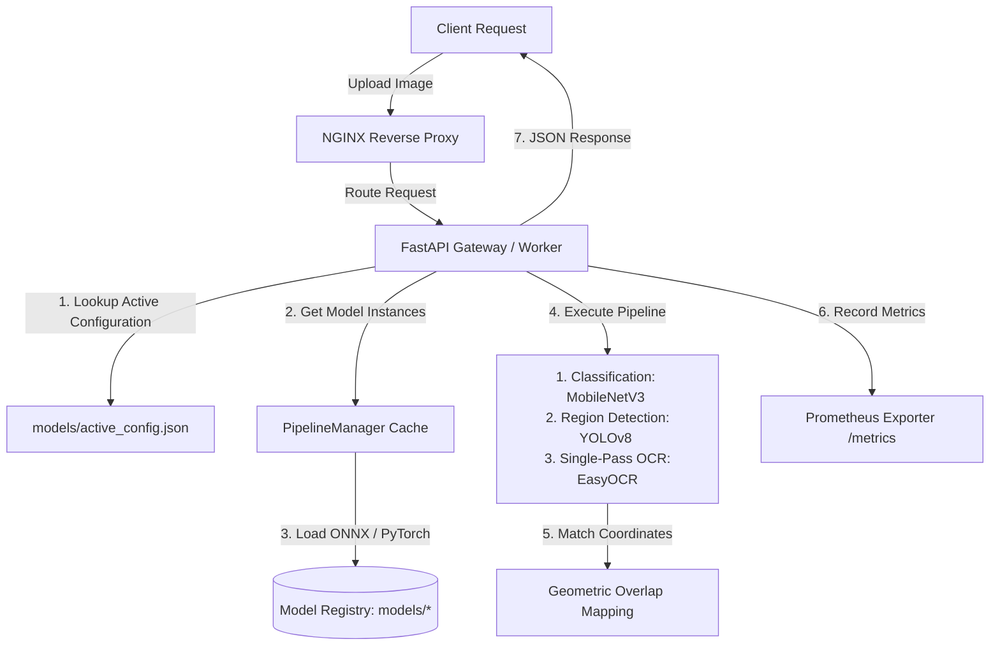

# Document Intelligence Service

A computer vision pipeline for document layout analysis and OCR built with FastAPI, YOLOv8, and EasyOCR with a thread-safe model-serving layer that handles runtime backend switching (PyTorch vs. ONNX Runtime) and configuration sharing across multi-worker deployments.

I built this to work through a specific set of problems that show up when you put a multi-model CV pipeline behind a real API: concurrent requests fighting over shared model state, OCR latency that scales badly with document complexity, and configuration that silently desyncs across worker processes. Below is what it does and how.

---

## Key System Features

- **Single-Pass OCR**: Runs EasyOCR once per request on the full page, then maps the extracted text back to YOLOv8-detected regions using a geometric overlap algorithm. This cuts OCR calls from $O(N)$ — one per detected region, plus one for the full page — down to exactly one.
- **Thread-Safe Model Caching**: A synchronized dictionary cache (`self._classifiers`, `self._detectors`) behind a `threading.Lock` lets concurrent requests process safely and lets backend/version swaps happen without corrupting shared model state.
- **Transactional Config Swapping**: `/config` updates only commit to shared storage after the new backend and model versions have successfully loaded into memory — a failed load never leaves the system in a half-updated state.
- **Multi-Process Config Sharing**: Serving settings live in a volume-mounted file (`models/active_config.json`) so worker processes can share backend/version state instead of drifting independently.
- **PII-Scrubbed Logging**: Structured JSON logging via `structlog`, with a custom scrubber that redacts OCR text, payload parameters, and other sensitive keys before they hit the logs.
- **Observability**: `/metrics` (Prometheus counters and duration histograms), `/ready` (readiness probe), `/health` (liveness probe).

---

## System Architecture



---

## Codebase Map

| File | Responsibility |
|---|---|
| [`src/main.py`](file:///d:/AntiG/IntelliDoc/src/main.py) | App entrypoint — FastAPI init, structured logging middleware, Prometheus mounting |
| [`src/api/routes.py`](file:///d:/AntiG/IntelliDoc/src/api/routes.py) | REST routes: processing, configuration, infra probes |
| [`src/services/pipeline.py`](file:///d:/AntiG/IntelliDoc/src/services/pipeline.py) | `PipelineManager` — caches, loading locks, request routing |
| [`src/services/ocr.py`](file:///d:/AntiG/IntelliDoc/src/services/ocr.py) | EasyOCR wrapper + geometric layout-mapping logic |
| [`src/services/classification.py`](file:///d:/AntiG/IntelliDoc/src/services/classification.py) | MobileNetV3 document type classifier |
| [`src/services/detection.py`](file:///d:/AntiG/IntelliDoc/src/services/detection.py) | YOLOv8-nano layout detector with NMS |
| [`src/core/config.py`](file:///d:/AntiG/IntelliDoc/src/core/config.py) | Settings + shared JSON state helpers |

---

## Design Trade-offs & What I'd Harden Next

I'd rather name these than pretend they don't exist:

1. **Lock granularity.** The loading lock is coarse right now — a cache hit can end up blocking behind a concurrent cache miss's model load. Double-checked locking (lock-free reads on cache hits) fixes this.
2. **Unbounded model cache.** Nothing currently evicts old `(backend, version)` entries, so a client cycling through many versions could grow memory without bound. An LRU cache with a size cap is the fix.
3. **Synchronous config I/O.** Workers read `models/active_config.json` on every request. Under high throughput, that's needless disk I/O on the hot path — better to cache in memory and reload on a filesystem-watcher or timestamp-check trigger instead.
4. **High-resolution latency scaling.** OCR execution time (EasyOCR) scales with image resolution and text density because text line extraction and recognition are executed sequentially on detected bounding boxes. Implementing an image preprocessing wrapper to cap maximum dimensions (e.g. max 2048px) before inference would stabilize latency.

---

## Getting Started

You can run this locally with a virtual environment, or with Docker Compose (recommended — this spins up the full architecture: API + NGINX + Prometheus, matching the diagram above).

### Option A: Docker Compose

1. **Prepare local model weights** (required for the container volume mount):
```powershell
   venv\Scripts\python src/services/export_models.py
```

2. **Build and start the container network** in the background:
```powershell
   docker compose up --build -d
```
   This builds the API image, pulls the NGINX and Prometheus base images, and boots all three containers.

3. **Verify the containers are running and healthy:**
```powershell
   docker compose ps
```
   You should see `doc_intel_api`, `doc_intel_nginx`, and `doc_intel_prometheus` in the `running` state.

4. **Access the services:**
   - Swagger API console: `http://localhost/docs` (proxied via NGINX on port 80)
   - Prometheus metrics panel: `http://localhost:9090`

5. **Test the endpoint:** In the Swagger dashboard, expand `POST /api/v1/process`, upload a sample document image (e.g. `demo/invoice.png`), and click Execute to see the JSON output.

6. **Teardown** when you're done:
```powershell
   docker compose down
```

### Option B: Local (venv)

1. **Install:**
```powershell
   python -m venv venv
   venv\Scripts\activate
   pip install -r requirements.txt
```

2. **Export models:**
```powershell
   venv\Scripts\python src/services/export_models.py
```
   Downloads pretrained weights for MobileNetV3 (classification) and YOLOv8 (detection), builds the `models/` registry, and exports both PyTorch (`.pt`) and ONNX (`.onnx`) versions.

3. **Run the server:**
```powershell
   venv\Scripts\uvicorn src.main:app --host 0.0.0.0 --port 8000
```
   Swagger docs at `http://localhost:8000/docs`.

---

## API

### `POST /api/v1/process`
`multipart/form-data`, payload: `file` (image).

Query params:
| Param | Type | Notes |
|---|---|---|
| `backend` | `"onnx"` \| `"pytorch"` | optional |
| `classifier_version` | string | optional, defaults to active config |
| `detector_version` | string | optional, defaults to active config |
| `conf_threshold` | float | optional, default `0.25` |

### `GET /api/v1/config`
Returns the active backend, active model versions, and boot defaults.

### `POST /api/v1/config`
```json
{
    "active_backend": "onnx",
    "classifier_version": "v1",
    "detector_version": "v1"
}
```
Transactional hot-swap of active serving parameters — commits only after the new backend/versions load successfully.

---

## Verification

**Tests:**
```powershell
venv\Scripts\pytest
```
Covers integration routes, model loading, and cache behavior.

**Load testing:**
```powershell
venv\Scripts\locust -f load_tests/locustfile.py
```
Web panel at `http://localhost:8089` for throughput and latency under concurrent load.
