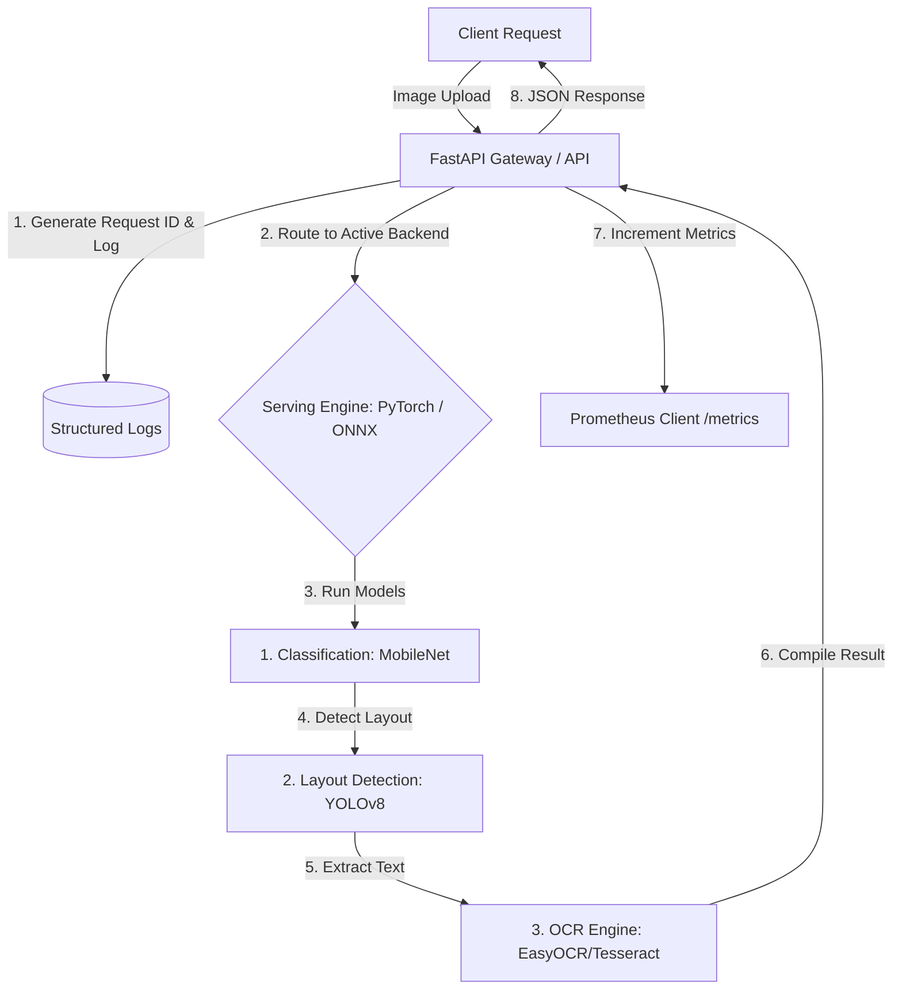

# Implementation Plan - Production-Grade Document Intelligence Service

This implementation plan outlines the systems engineering and architecture design for the Document Intelligence Service. The goal is to build a production-grade CV pipeline focusing on latency, reliability, monitoring, and versioning.

## Problem Statement & Done Criteria

### The Problem
Most Computer Vision (CV) showcase projects focus exclusively on model training and accuracy, leaving serving infrastructure as an afterthought. This project addresses the systems engineering challenges of deploying a multi-stage CV pipeline (Classification -> Object Detection -> OCR) with production-grade monitoring, versioning, performance benchmarking, and graceful degradation under load or failure.

### "Done" Definition (Smallest Useful Version)
A containerized async FastAPI service running locally or on a cloud instance that:
1. Receives an image via a REST endpoint.
2. Runs it through a model pipeline: Document Classification (e.g., MobileNetV3 CPU) -> Document Region Detection (YOLOv8 nano CPU) -> Text Extraction (EasyOCR or PyTorch-based text recognizer).
3. Exposes standard production instrumentation: health/readiness endpoints, structured logs with correlation IDs, and Prometheus metrics.
4. Includes a load testing suite (Locust) to benchmark latency (p50/p95/p99) and identify breaking points.

---

## User Review Required

> [!IMPORTANT]
> **Resource Limitations on Free-Tier Hosting Platforms**
> Standard free-tier services (Render/Railway/Fly.io) restrict memory to 512MB or 1GB RAM, and restrict Docker build times. Loading PyTorch (CPU version is ~200MB+ but package size is huge), YOLOv8 (Ultralytics + dependencies), EasyOCR (PyTorch-based, downloads models on startup), and Tesseract system libraries will likely exceed the free tier's RAM limits at runtime (causing out-of-memory OOM crashes) and build size limits. 
> 
> **Recommendation:** We propose deploying this to a local Docker container or a dedicated/larger cloud instance (e.g., AWS EC2 t3.medium or Railway paid tier) for validation, rather than standard free-tier hosting, OR we must design aggressive model optimizations (converting everything to ONNX Runtime and using lightweight packages).

> [!WARNING]
> **TorchServe Serving Backend**
> The project brief mentions comparing native PyTorch, ONNX Runtime, and TorchServe. TorchServe is extremely heavy, Java-dependent, and has a steep configuration curve that requires a separate container or complex multi-process management.
> 
> **Recommendation:** We propose focusing on Native PyTorch vs ONNX Runtime inside the FastAPI application using dynamic model swapping first. TorchServe benchmarking can be deferred or run as a separate isolated container setup to keep the core service clean.

---

## Open Questions

> [!IMPORTANT]
> 1. **Target Deployment Target & Specifications:** Do you have a specific target platform (e.g., a local Docker setup, an AWS account, or a Railway account) where we can deploy this, or is a local docker-compose environment with a detailed setup guide sufficient?
> 2. **Model Swapping and Storage:** Where should the different model versions be hosted? Should we store them locally within the project repo/Docker image (simplest for MVP), download them from Hugging Face Hub on startup, or use a mock cloud storage provider (like a local MinIO container)?
> 3. **Data Privacy / Sensitive Data:** Will the documents uploaded contain personally identifiable information (PII) or sensitive data? If yes, we will implement request sanitization and disable logging of extracted OCR text or raw payload contents.

---

## Proposed Architecture

---

## Proposed MVP Scope vs. Deferred Features

### MVP Scope (Phase 1)
- **FastAPI Core Service**: Async endpoints for document processing (`/api/v1/process`), configuration-based model backend switching (Native PyTorch vs ONNX Runtime), structured errors, and dynamic request validation.
- **Serving Engines**: Implement two serving adapters (PyTorch CPU and ONNX Runtime).
- **Core Pipeline**:
  - Classification: MobileNetV3 (lightweight, PyTorch/ONNX representation).
  - Region Detection: YOLOv8-nano (runs efficiently on CPU).
  - OCR: EasyOCR or Tesseract (pre-installed in Docker image).
- **Observability**:
  - `/health` (liveness) & `/ready` (readiness check ensuring model files are loaded).
  - Structured JSON logs using `structlog` (Request ID correlation, model execution latencies, confidence metrics).
  - `/metrics` endpoint with Prometheus counters and histograms (request duration, status code counts).
- **Dockerization**: A multi-stage `Dockerfile` optimized for size, compiling Tesseract dependencies or caching PyTorch wheels.
- **Model Versioning & Rollback**: Simple local filesystem model registry. Swapping the active model path via an API config-reload endpoint or config file change without redeploying code.
- **Load Testing**: Locust script configured to simulate concurrent clients and measure throughput/latencies.

### Deferred / Later List (Phase 2+)
- **TorchServe Backend**: Running TorchServe as a sidecar container.
- **Advanced Model Drift Dashboard**: Multi-day dashboard analyzing confidence score distribution shifts (instead, MVP will log confidence values to metrics and logs for Prometheus dashboards).
- **GitHub Actions Cloud Deploy**: Automatic CD push to a live cloud endpoint (we will set up local Docker deployment and basic CI testing first).

---

## Build Order

1. **Step 1: Codebase Setup & Configuration System**
   - Initialize Python environment (`poetry` or `pip` with `pyproject.toml`).
   - Setup configuration management (env variables, Pydantic settings).
   - Implement dynamic local model loader/version manager.
2. **Step 2: Core Machine Learning Pipeline**
   - Write wrapper classes for Classification (MobileNet), Region Detection (YOLOv8), and OCR (Tesseract/EasyOCR).
   - Convert models to ONNX and verify ONNX Runtime performance matches native PyTorch.
3. **Step 3: FastAPI Web Service & Observability**
   - Build API skeleton with structured routing.
   - Integrate the ML pipeline into async FastAPI endpoints.
   - Implement `structlog` middleware for correlation IDs and structured logs.
   - Integrate `prometheus-client` for metric tracking.
4. **Step 4: Dockerization & Production Config**
   - Write the production-grade `Dockerfile` and `docker-compose.yml`.
   - Setup reverse proxy (NGINX/Caddy) with rate limiting.
5. **Step 5: Testing & Benchmarking**
   - Implement unit and integration tests (PyTest).
   - Create Locust load testing script.
   - Generate benchmarking report comparing PyTorch vs ONNX Runtime latency.

---

## Verification Plan

### Automated Tests
- `pytest tests/unit` - Verify model loader, configuration parsing, API schema validations.
- `pytest tests/integration` - End-to-end integration tests submitting test images to `/api/v1/process`.

### Manual Verification
- Run load testing: `locust -f load_tests/locustfile.py --headless -u 10 -r 2 --run-time 2m`
- Verify metrics and health: `curl http://localhost:8000/health` and `curl http://localhost:8000/metrics`
